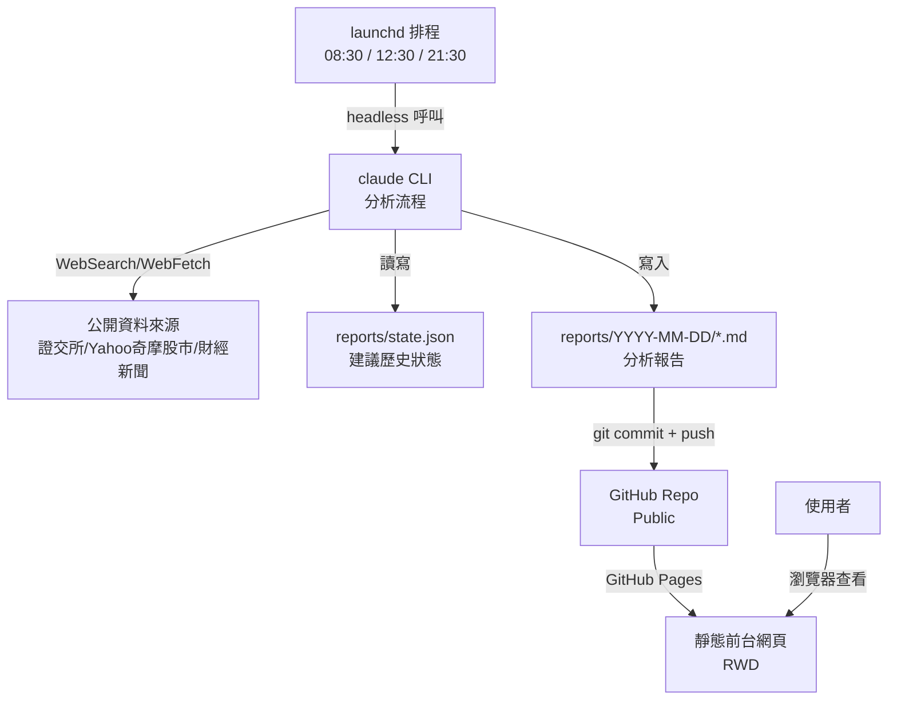

# 系統架構 — BLACKJ-STOCK-POINT-GUARD

## 全景圖

## Layer 驗收狀態

| Layer | 名稱 | UC 範圍 | 狀態 |
|---|---|---|---|
| Layer 1 | 環境建置與排程骨架 | UC-BJSPG 3.1.1 ～ 3.1.3 | ✅ |
| Layer 2 | 分析與報告產出邏輯 | UC-BJSPG 3.5.1 ～ 3.5.6 | ⏳ |
| Layer 3 | 前台 Dashboard | UC-BJSPG 3.2.1 ～ 3.2.3 | ⏳ |
| Layer 4 | 端對端整合測試 | 全部 UC | ⏳ |

## 資料 Schema

不使用資料庫。資料落地為兩種檔案：

- `reports/{YYYY-MM-DD}/{HHMM}_{PRE|MID|POST}.md` — 每次排程產出的分析報告
- `reports/state.json` — 記錄每檔關注股最近一次建議動作，供回補提示比對用（結構待 Layer 2 實作時定案）

## 待確認事項

- **GitHub Pages 部署路徑衝突**：專案已用 `docs/` 存放 TODO/SETUP/design 等專案文件，但 GitHub Pages 原生設定只能選擇 repo 根目錄或 `/docs` 當發布來源。若要用 `web/` 目錄當前台網頁內容，需要在 Layer 3 決定用 GitHub Actions 建置並部署到 `gh-pages` 分支，或改變資料夾配置。此事項留到 Layer 3 開始前定案，不影響 Layer 1、2 的實作。
