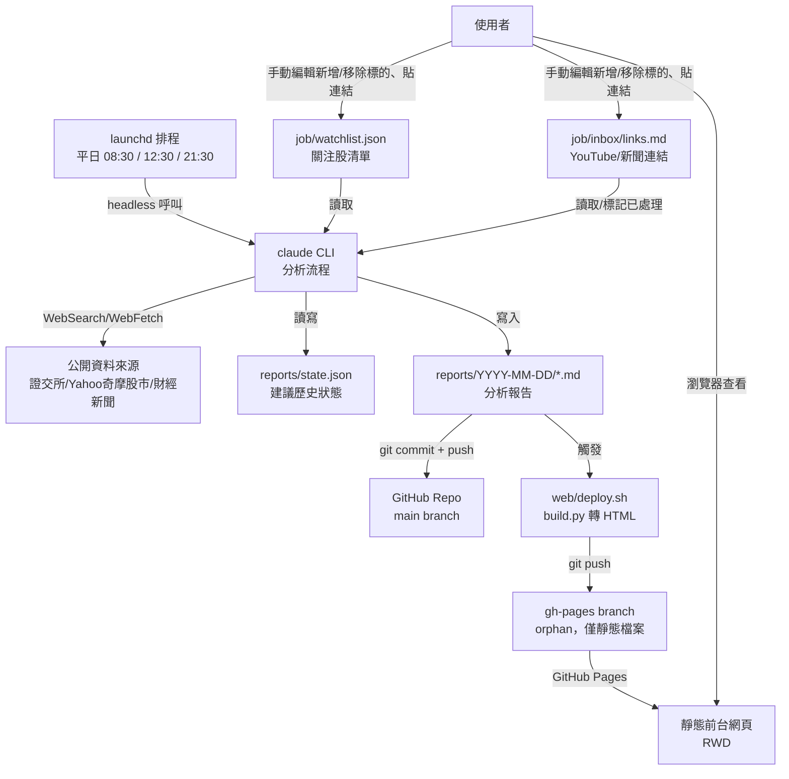

# 系統架構 — BLACKJ-STOCK-POINT-GUARD

## 全景圖

## Layer 驗收狀態

| Layer | 名稱 | UC 範圍 | 狀態 |
|---|---|---|---|
| Layer 1 | 環境建置與排程骨架 | UC-BJSPG 3.1.1 ～ 3.1.3 | ✅ |
| Layer 2 | 分析與報告產出邏輯 | UC-BJSPG 3.5.1 ～ 3.5.6 | ⏳（正式交易日情境待 Layer 4） |
| Layer 3 | 前台 Dashboard | UC-BJSPG 3.2.1 ～ 3.2.3 | ⏳（程式完成，待使用者手動開啟 GitHub Pages 設定） |
| Layer 4 | 端對端整合測試 | 全部 UC | ⏳ |

## 資料 Schema

不使用資料庫。資料落地為兩種檔案：

- `reports/{YYYY-MM-DD}/{HHMM}_{PRE|MID|POST}.md` — 每次排程產出的分析報告
- `reports/state.json` — 記錄每檔關注股最近一次建議動作，供回補提示比對用（結構待 Layer 2 實作時定案）
- `gh-pages` branch（orphan，與 `main` 無共同歷史）— 只放 `web/build.py` 產生的靜態 HTML，GitHub Pages 直接從此 branch 的 root 發布

## 前台網頁部署機制（Layer 3 定案）

- **決策**：不使用 GitHub Actions，改用「本機腳本 + 獨立 `gh-pages` orphan branch」。原因：`docs/` 已作專案文件用途，GitHub Pages 原生設定只能選 repo 根目錄或 `/docs`；且排程本來就在本機跑、已有 git push 流程，多一層 CI 對單人專案不符合 Simplicity First。
- **流程**：`job/run_analysis.sh` 完成報告 commit/push 後，呼叫 `web/deploy.sh` → 用獨立 git worktree（`.gh-pages-worktree/`，已 gitignore）簽出 `gh-pages` branch → 執行 `web/build.py`（純 Python 標準函式庫，掃描 `reports/` 轉出 HTML，不依賴 pandoc/pip 套件）→ commit + push 到 `gh-pages`。
- **待辦**：GitHub Pages 需使用者手動到 repo Settings → Pages 選 `gh-pages` / root 一次（無 `gh` CLI 或 API token 可自動化此步驟）。
