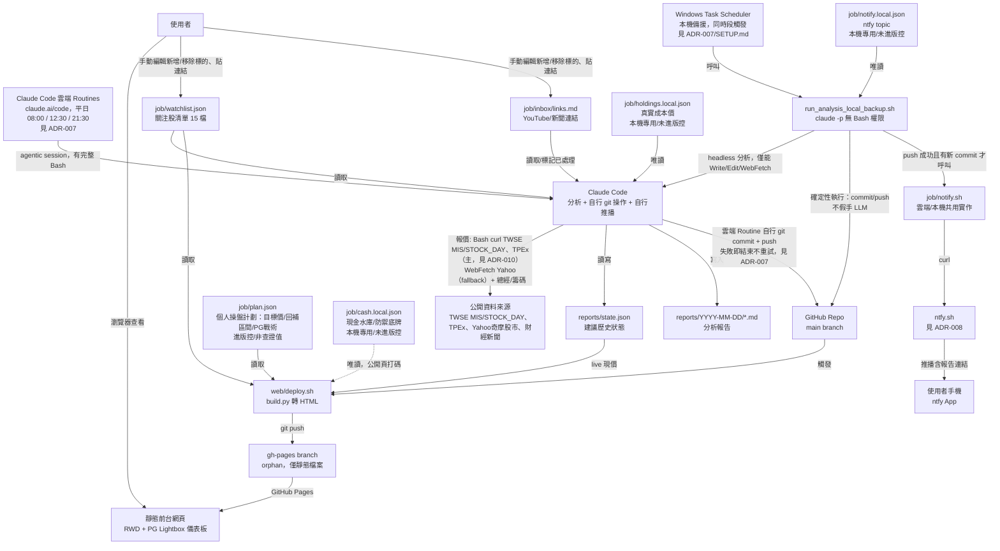

# 系統架構 — BLACKJ-STOCK-POINT-GUARD

## 全景圖

```mermaid
graph TD
    L[Claude Code 雲端 Routines<br/>claude.ai/code，平日 08:00 / 12:30 / 21:30<br/>見 ADR-007] -->|agentic session，有完整 Bash| C[Claude Code<br/>分析 + 自行 git 操作 + 自行推播]
    LB[Windows Task Scheduler<br/>本機備援，同時段觸發<br/>見 ADR-007/SETUP.md] -->|呼叫| RS[run_analysis_local_backup.sh<br/>claude -p 無 Bash 權限]
    RS -->|headless 分析，僅能 Write/Edit/WebFetch| C
    RS -->|確定性執行：commit/push<br/>不假手 LLM| G
    C -->|報價: Bash curl TWSE MIS/STOCK_DAY、TPEx（主，見 ADR-010）<br/>WebFetch Yahoo（fallback）+ 總經/籌碼| D[公開資料來源<br/>TWSE MIS/STOCK_DAY、TPEx、Yahoo奇摩股市、財經新聞]
    WL[job/watchlist.json<br/>關注股清單 15 檔] -->|讀取| C
    IB[job/inbox/links.md<br/>YouTube/新聞連結] -->|讀取/標記已處理| C
    HL[job/holdings.local.json<br/>真實成本價<br/>本機專用/未進版控] -->|唯讀| C
    NL[job/notify.local.json<br/>ntfy topic<br/>本機專用/未進版控] -->|唯讀| RS
    PL[job/plan.json<br/>個人操盤計劃：目標價/回補區間/PG戰術<br/>進版控/非查證值] -->|讀取| B
    CL[job/cash.local.json<br/>現金水庫/防禦底牌<br/>本機專用/未進版控] -.->|唯讀，公開頁打碼| B
    WL -->|讀取| B
    S -->|live 現價| B
    C -->|讀寫| S[reports/state.json<br/>建議歷史狀態]
    C -->|寫入| R[reports/YYYY-MM-DD/*.md<br/>分析報告]
    C -->|雲端 Routine 自行 git commit + push<br/>失敗即結束不重試，見 ADR-007| G[GitHub Repo<br/>main branch]
    G -->|觸發| B[web/deploy.sh<br/>build.py 轉 HTML]
    B -->|git push| GP[gh-pages branch<br/>orphan，僅靜態檔案]
    GP -->|GitHub Pages| W[靜態前台網頁<br/>RWD + PG Lightbox 儀表板]
    RS -->|push 成功且有新 commit 才呼叫| NS[job/notify.sh<br/>雲端/本機共用實作]
    NS -->|curl| NT[ntfy.sh<br/>見 ADR-008]
    NT -->|推播含報告連結| PH[使用者手機<br/>ntfy App]
    U[使用者] -->|瀏覽器查看| W
    U -->|手動編輯新增/移除標的、貼連結| WL
    U -->|手動編輯新增/移除標的、貼連結| IB
```

> `job/run_analysis.sh`、`job/launchd/*.plist`（本機 macOS launchd 呼叫 headless `claude -p`）為原始設計，現已徹底停用、僅存檔案作歷史紀錄，跟圖中的「Windows Task Scheduler 本機備援」是不同機制，不要混淆。`web/deploy.sh` 在雲端 Routine 路徑由 LLM 自己在 `git push` 成功後呼叫（見 `job/prompts/*.md` 版本控制段落）；在本機備援路徑則由 `run_analysis_local_backup.sh` 確定性呼叫，因為該路徑呼叫 `claude -p` 時 `--allowedTools` 未授權 Bash，git commit/push、`append_continuity_table.py`、`web/deploy.sh`、ntfy 推播這幾步都不能指望 LLM 執行，一律由 shell script 本身完成（見 ADR-001、ADR-008）。`job/notify.sh` 是雲端 Routine 與本機備援共用的推播實作（2026-08-11 code review 後從各自手刻的 curl 指令抽出，避免同一組邏輯散落多個 prompt 檔），兩條路徑都呼叫同一支 script，不再各自維護一份。2026-08-11 08:00 PRE 已實跑驗證本機備援路徑全鏈路（分析 → commit/push → deploy → 推播）成功。

## Layer 驗收狀態

| Layer | 名稱 | UC 範圍 | 狀態 |
|---|---|---|---|
| Layer 1 | 環境建置與排程骨架 | UC-BJSPG 3.1.1 ～ 3.1.3 | ✅ |
| Layer 2 | 分析與報告產出邏輯 | UC-BJSPG 3.5.1 ～ 3.5.6 | ⏳（正式交易日情境待 Layer 4） |
| Layer 3 | 前台 Dashboard | UC-BJSPG 3.2.1 ～ 3.2.3 | ✅ |
| Layer 4 | 端對端整合測試 | 全部 UC | ⏳ |
| Layer 5 | PG Lightbox 儀表板與報告精簡化 | SDD 6.8、ADR-009 | ⏳（實作完成，待排程實跑驗證） |

## 資料 Schema

不使用資料庫。資料落地為兩種檔案：

- `reports/{YYYY-MM-DD}/{HHMM}_{PRE|MID|POST}.md` — 每次排程產出的分析報告
- `reports/state.json` — 記錄每檔關注股最近一次建議動作，供回補提示比對用。每檔股票欄位：`name`、`last_action`、`last_action_time`、`last_report`、`pending_rebuy`，以及 2026-07-05 新增的 `last_price`（最近查證收盤價）、`limit_range`（金字塔限價低接第一批區間）——後兩者供 MID/POST 報告撰寫「延續數據表」時讀取延續，讓前台重點摘要在非 PRE 報告也能顯示股價/限價（見 SDD.md 6.5、ADR-005）
- `job/holdings.local.json`（**本機專用，`.gitignore` 排除，不進 Git 歷史**）— 使用者真實持股快照：代號、股數、`cost_basis`（真實成本價），供護盾續抱規則使用（見 SDD.md 6.6、ADR-006）；此檔案不隨 `git pull` 同步到其他機器，遷移常駐機器時需手動另外處理
- `job/notify.local.json`（**本機專用，`.gitignore` 排除，不進 Git 歷史**）— 存放 ntfy.sh 推播 topic 名稱（見 SDD.md 6.7、ADR-008）；跟 `holdings.local.json` 同樣不隨雲端 Routine 的沙盒同步，所以雲端 Routine 路徑實際上不會真的發出通知，只有本機備援路徑會
- `job/plan.json`（進版控）— PG Lightbox 儀表板的「個人操盤計劃」：每檔 `target`（波段目標價）、`rebuy_range`（回補/低接區間）、`pg_note`（PG 戰術）、`group`（分組）、`ref_price`（fallback 參考價）。屬非查證值，前台標籤化呈現、與 live 現價分區（見 SDD.md 6.3 例外、6.8、ADR-009）
- `job/cash.local.json`（**本機專用，`.gitignore` 排除**）— 現金水庫（`total_cash`）、防禦底牌持股、當前姿勢。公開 GitHub Pages 一律打碼，僅本機 `BJSPG_LOCAL_PREVIEW=1` 執行 `build.py` 才渲染真數字（見 SDD.md 6.8、ADR-009）
- `gh-pages` branch（orphan，與 `main` 無共同歷史）— 只放 `web/build.py` 產生的靜態 HTML，GitHub Pages 直接從此 branch 的 root 發布

## 前台網頁部署機制（Layer 3 定案）

- **決策**：不使用 GitHub Actions，改用「本機腳本 + 獨立 `gh-pages` orphan branch」。原因：`docs/` 已作專案文件用途，GitHub Pages 原生設定只能選 repo 根目錄或 `/docs`；且排程本來就在本機跑、已有 git push 流程，多一層 CI 對單人專案不符合 Simplicity First。
- **流程**：`job/run_analysis.sh` 完成報告 commit/push 後，呼叫 `web/deploy.sh` → 用獨立 git worktree（`.gh-pages-worktree/`，已 gitignore）簽出 `gh-pages` branch → 執行 `web/build.py`（純 Python 標準函式庫，掃描 `reports/` 轉出 HTML，不依賴 pandoc/pip 套件）→ commit + push 到 `gh-pages`。
- **已完成**：使用者已於 2026-07-05 手動到 repo Settings → Pages 選 `gh-pages` / root 一次，網站已上線：https://blackjtsai.github.io/blackj-stock-point-guard/
